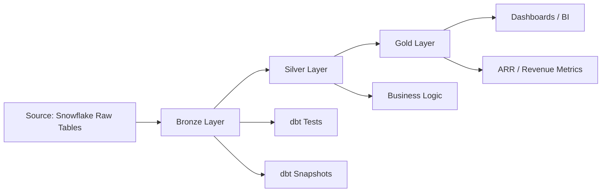

# snowflake-fivetran-medallion-pipeline

A production-style dbt project built to model e-commerce/contract data using a medallion architecture on Snowflake. The pipeline ingests raw customer, contract, and transaction data, standardizes it through bronze and silver layers, and exposes business-ready analytics in the gold layer.

## Overview

This project is designed to transform raw operational data into analytical tables for:

- customer-level reporting
- transactional fact analysis
- contract health monitoring
- monthly revenue summaries
- ARR (Annual Recurring Revenue) estimation
- historical tracking using dbt snapshots

The architecture follows the classic medallion pattern:

- Bronze: raw staging and standardization
- Silver: clean dimension and fact tables
- Gold: business aggregates and KPIs

## Architecture



## Layers

### Bronze

Raw source tables are standardized and exposed as staging models:

- `stg_customers`
- `stg_contracts`
- `stg_transactions`

These models clean the raw field names and remove deleted records from Fivetran-synced data.

### Silver

Curated business entities are modeled here:

- `dim_customers`
- `fct_transactions`

This layer creates customer dimensions and transaction facts with normalized relationships.

### Gold

Business-ready metrics are built here:

- `monthly_revenue_summary`
- `customer_lifetime_value`
- `arr_revenue`
- `customer_arr`

These tables are designed for reporting, KPI dashboards, and executive summaries.

## Business Rules Implemented

The project includes business validation logic for:

- unique keys and not-null constraints
- valid contract date ranges
- positive transaction values
- valid contract/customer references
- consistent contract counts per customer
- non-negative revenue totals
- ARR mapping by billing frequency and contract type

## Data Sources

The project reads from the ecommerce source in Snowflake:

- `SATYAM.PUBLIC.customers`
- `SATYAM.PUBLIC.contracts`
- `SATYAM.PUBLIC.transactions`

These are mapped through the `source.yml` configuration and used by the staging models.

## Snapshot Strategy

Historical changes are tracked for key source tables using dbt snapshots:

- `contracts_snapshot`
- `transactions_snapshot`

This enables tracking changes over time without reprocessing the entire raw dataset.

## Seed Mapping for ARR

ARR logic is driven by a seed mapping table:

- `seeds/arr_mapping_seed.csv`

This mapping converts raw contract types into business tags and annualization multipliers such as:

- Monthly → 12
- Quarterly → 4
- Annual → 1
- One-time → 0

This ensures recurring revenue can be annualized in a consistent, repeatable way.

## Project Structure

```text
.
├── dbt_project.yml
├── README.md
├── analyses/
├── macros/
├── models/
│   ├── bronze/
│   ├── silver/
│   └── gold/
├── seeds/
│   └── arr_mapping_seed.csv
├── snapshots/
│   ├── contracts_snapshot.sql
│   └── transactions_snapshot.sql
├── tests/
│   ├── fct_transactions_amount_positive.sql
│   ├── stg_contracts_valid_date_ranges.sql
│   ├── fct_transactions_valid_references.sql
│   ├── dim_customers_contract_counts_consistent.sql
│   └── monthly_revenue_summary_non_negative.sql
└── target/
```

## Tech Stack

- dbt Core
- Snowflake
- SQL
- GitHub
- dbt Snapshots
- dbt Seeds
- dbt Tests

## Setup

1. Clone the repository
2. Configure your dbt profile for Snowflake
3. Install dbt dependencies if needed
4. Run the project

### Commands

```bash
dbt seed
dbt run
dbt test
dbt snapshot
```

## Typical Workflow

```bash
dbt seed
dbt run
dbt test
dbt docs generate
dbt docs serve
```

## Quality & Governance

This project follows analytical engineering best practices:

- layered transformations with clear ownership
- data quality tests for critical business logic
- reference integrity checks
- snapshotting for change tracking
- consistent KPI definitions

## Key Metrics Delivered

- Monthly revenue performance
- Successful vs failed transaction trends
- Customer contract counts
- Customer lifetime value
- ARR by customer and contract type

## Status

The project is currently configured and validated for:

- model execution
- seed loading
- snapshot creation
- data quality checks
- ARR calculation logic

## License

This project is for internal analytics and business intelligence use. Please check your organization’s licensing and data governance policies before publishing or sharing externally.

## Author

Satyam Analytics Engineering
